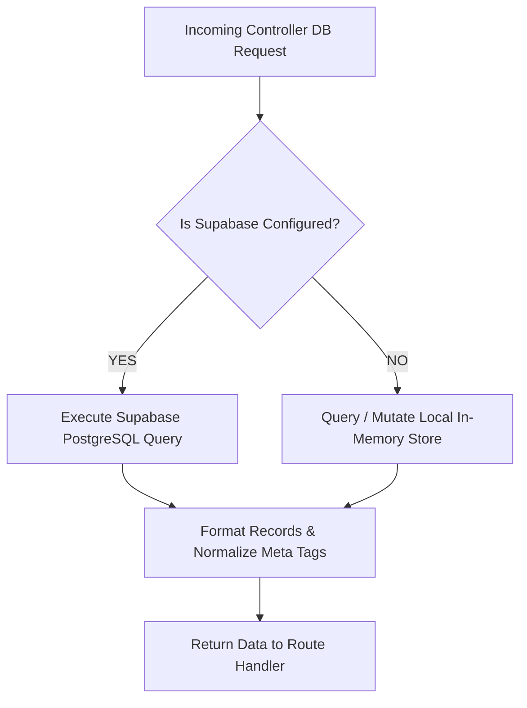
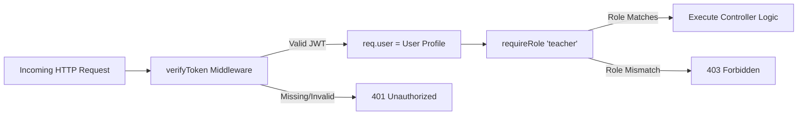
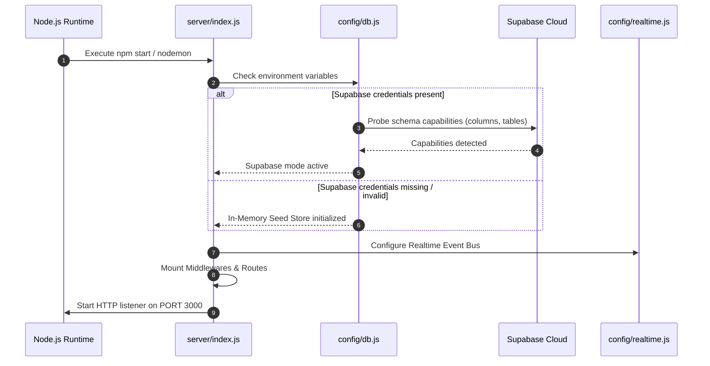
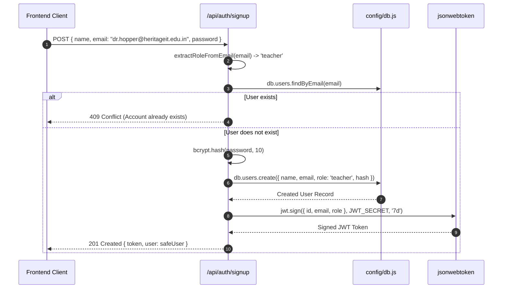
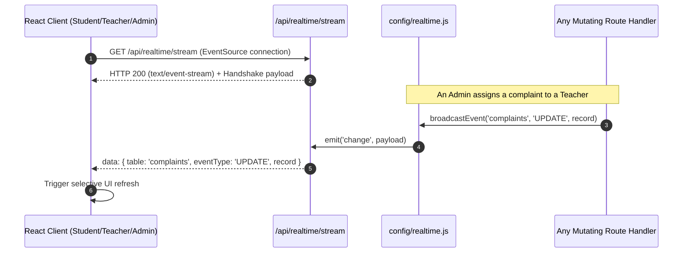
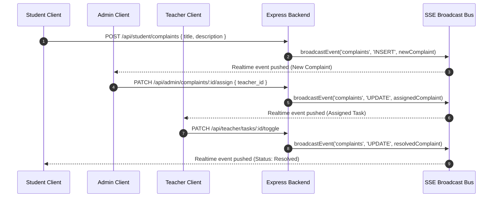
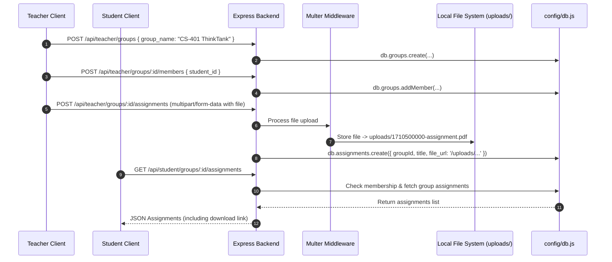
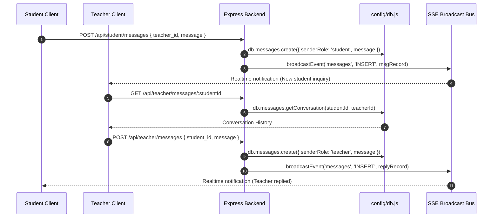

# 🏛️ CampusSphere Backend Architecture & Flow Guide

---

## 📑 Table of Contents
1. [System Overview & Architecture Philosophy](#1-system-overview--architecture-philosophy)
2. [Tech Stack Deep-Dive](#2-tech-stack-deep-dive)
3. [Server Directory Structure](#3-server-directory-structure)
4. [Backend Layer Breakdown](#4-backend-layer-breakdown)
   - [4.1 Entry Point (`server/index.js`)](#41-entry-point-serverindexjs)
   - [4.2 Dual-Mode Database Engine (`server/config/db.js`)](#42-dual-mode-database-engine-serverconfigdbjs)
   - [4.3 Real-Time SSE Event Bus (`server/config/realtime.js`)](#43-real-time-sse-event-bus-serverconfigrealtimejs)
   - [4.4 Authentication & Access Control Middleware (`server/middleware/auth.js`)](#44-authentication--access-control-middleware-servermiddlewareauthjs)
   - [4.5 Route Controllers (`server/routes/*`)](#45-route-controllers-serverroutes)
   - [4.6 Static Asset Management (`server/uploads/`)](#46-static-asset-management-serveruploads)
5. [End-to-End Request Lifecycles & Visual Diagrams](#5-end-to-end-request-lifecycles--visual-diagrams)
   - [5.1 Server Initialization & Bootstrapping](#51-server-initialization--bootstrapping)
   - [5.2 Domain-Driven Authentication & Authorization](#52-domain-driven-authentication--authorization)
   - [5.3 Server-Sent Events (SSE) Real-Time Synchronization](#53-server-sent-events-sse-real-time-synchronization)
   - [5.4 Complaint Management Lifecycle](#54-complaint-management-lifecycle)
   - [5.5 Group, Assignment & File Upload Lifecycle](#55-group-assignment--file-upload-lifecycle)
   - [5.6 Bidirectional Teacher-Student Messaging Flow](#56-bidirectional-teacher-student-messaging-flow)
6. [Complete REST API Reference Matrix](#6-complete-rest-api-reference-matrix)
7. [Security & Resilience Safeguards](#7-security--resilience-safeguards)

---

## 1. System Overview & Architecture Philosophy

CampusSphere backend is an **Enterprise Role-Based Educational Management Server** designed to coordinate operations across three distinct academic personas:
- 👑 **Admin**: Campus oversight, institution metrics, complaint triage, and teacher task assignment.
- 🎓 **Teacher**: Student grouping, assignment authoring with file attachments, announcements, student grade evaluation, complaint resolution tasks, and bidirectional student messaging.
- 🎒 **Student**: Submitting campus complaints, accessing enrolled groups, downloading group-specific coursework, tracking grade performance, and direct messaging faculty.

### Core Architectural Pillars
1. **Zero-Setup Resilience (Dual-Mode Database Layer)**: Operates seamlessly against cloud **Supabase PostgreSQL** when configured, and falls back gracefully to a fully seeded **In-Memory Data Store** with zero external dependencies during offline or testing phases.
2. **Domain-Driven Role Assignment**: Role permissions (`admin`, `teacher`, `student`) are strictly bound to organization email domains (`@admin.org`, `@heritageit.edu.in`, `@gmail.com`), eliminating identity spoofing.
3. **Reactive Real-Time Synchronization**: Utilizes standard **Server-Sent Events (SSE)** coupled with Node.js `EventEmitter` to push live state updates (complaints, marks, assignments, messages) to clients without WebSocket overhead.
4. **Stateless JWT Security**: Every protected endpoint enforces cryptographically signed JSON Web Tokens containing role payloads and user IDs.

---

## 2. Tech Stack Deep-Dive

| Technology / Library | Version | Purpose & Architectural Role |
| :--- | :--- | :--- |
| **Node.js (ES Modules)** | `v18+` / `v20+` | Runtime environment leveraging native modern ESM (`import`/`export`) syntax for clean modular design. |
| **Express.js** | `^4.21.2` | Minimalist web framework managing HTTP routing, request pipelines, and custom middleware chains. |
| **@supabase/supabase-js** | `^2.49.1` | Official client for Supabase PostgreSQL database queries, relation joins, and schema interactions. |
| **jsonwebtoken (JWT)** | `^9.0.2` | Issues and verifies cryptographically signed session tokens (`HS256`) with a 7-day expiration. |
| **bcryptjs** | `^3.0.2` | One-way hashing algorithm with automated salting (10 rounds) for password protection. |
| **Multer** | `^1.4.5-lts.1` | Multi-part form data handler processing teacher assignment files with automated disk persistence and sanitization. |
| **CORS** | `^2.8.5` | Cross-Origin Resource Sharing middleware enabling decoupled Vite/React frontend integration. |
| **dotenv** | `^16.4.7` | Loads sensitive environment variables (`SUPABASE_URL`, `SUPABASE_ANON_KEY`, `JWT_SECRET`, `PORT`). |
| **UUID** | `^11.1.0` | Generates RFC4122 v4 universally unique identifiers for local records, groups, and assignments. |
| **Nodemon** | `^3.1.14` | Development auto-reloader observing file changes across the backend codebase. |

---

## 3. Server Directory Structure

```
server/
├── config/
│   ├── db.js             # Dual-mode database interface & seed store (Supabase + In-Memory)
│   └── realtime.js       # Node EventEmitter & SSE broadcast dispatcher
├── middleware/
│   └── auth.js           # JWT token verification (verifyToken) & Role Guard (requireRole)
├── routes/
│   ├── auth.js           # Signup, login, domain auto-detection, and identity introspection (/me)
│   ├── admin.js          # Campus stats, teacher directory, complaint assignment & triage
│   ├── teacher.js        # Groups, assignments, announcements, marks, chat, and admin task resolution
│   └── student.js        # Complaints, enrolled groups, coursework download, marks, teacher messaging
├── uploads/              # Local storage repository for assignment PDFs/documents
├── .env                  # Environment secrets & database keys
├── .env.example          # Sample environment configuration template
├── index.js              # Express app bootstrap, SSE stream pipeline, global error handling
└── package.json          # Server dependencies and lifecycle scripts
```

---

## 4. Backend Layer Breakdown

### 4.1 Entry Point (`server/index.js`)
The root file initializes Express, attaches global middlewares, boots real-time streams, mounts modular routes, and handles runtime failures:
1. **CORS & JSON Body Parsing**: Allows all HTTP methods (`GET`, `POST`, `PUT`, `PATCH`, `DELETE`, `OPTIONS`) and sets up JSON payload parsers.
2. **Static Upload Distribution**: Mounts `/uploads` via `express.static()` so client dashboards can fetch uploaded assignment files.
3. **SSE Connection Hub (`/api/realtime/stream`)**: Configures persistent HTTP connections (`text/event-stream`), registers client listeners on `realtimeBus`, and sends keep-alive heartbeats every 25 seconds.
4. **Live Public Stats (`/api/realtime/stats`)**: Unauthenticated endpoint powering landing page live counters.
5. **Route Modularization**: Mounts sub-routers onto `/api/auth`, `/api/admin`, `/api/teacher`, `/api/student`.
6. **Global 404 & Error Handler**: Catches unhandled promise rejections and malformed API requests cleanly with JSON errors.

---

### 4.2 Dual-Mode Database Engine (`server/config/db.js`)
The data layer abstracts database queries behind a uniform JavaScript API (`db.users`, `db.complaints`, `db.groups`, `db.assignments`, `db.announcements`, `db.marks`, `db.messages`, `db.admin`):



- **Dynamic Schema Probing (`probeSchema()`)**: Probes the Supabase database on startup to detect column availability (`group_id`, `due_date`, `sender_role`, `announcements` table).
- **Metadata Fallback Encoding**: If advanced columns are missing in remote tables, the engine embeds metadata into description fields (e.g. `<!--META:{"group_id":"g-1", "due_date":"..."}-->`) and message prefixes (e.g. `[ROLE:teacher]`), guaranteeing backward compatibility.
- **In-Memory Seed Store**: Contains pre-populated mock records for 1 Admin, 5 Teachers, 8 Students, 6 Academic Groups, 7 Assignments, 5 Announcements, and live Complaint threads.

---

### 4.3 Real-Time SSE Event Bus (`server/config/realtime.js`)
Unlike heavy WebSockets that require dedicated protocol upgrades, CampusSphere uses **Server-Sent Events (SSE)** via a central Node.js `EventEmitter`:
- **`broadcastEvent(table, eventType, record)`**: Triggered whenever any database mutation occurs (`INSERT`, `UPDATE`, `DELETE`).
- **SSE Stream Pipeline**: Emits structured JSON payloads to all connected clients. Clients immediately refresh their local React state without page reloads.

---

### 4.4 Authentication & Access Control Middleware (`server/middleware/auth.js`)
Security is applied in a two-stage verification barrier:

1. **`verifyToken`**:
   - Extracts the `Authorization: Bearer <token>` header.
   - Decodes and validates the token using `JWT_SECRET`.
   - Queries `db.users.findById()` to ensure the user still exists in the database.
   - Injects the authenticated user object into `req.user`.

2. **`requireRole(...allowedRoles)`**:
   - Compares `req.user.role` with allowed permissions.
   - Throws `403 Forbidden` if unauthorized.



---

### 4.5 Route Controllers (`server/routes/*`)
The application logic is partitioned into dedicated domain routers:
- **`auth.js`**: Domain recognition, password hashing (`bcrypt`), JWT generation, and identity profile retrieval.
- **`admin.js`**: Aggregated stats, teacher roster lookup, complaint triage, and assignment to faculty.
- **`teacher.js`**: Group creation, student enrollment, assignment uploads via Multer, grade assignment, complaint task execution, and student chat.
- **`student.js`**: Complaint creation, group lookup, assignment access, grade inspection, and messaging teachers.

---

### 4.6 Static Asset Management (`server/uploads/`)
- Handles file uploads using `multer.diskStorage()`.
- Automatically generates unique timestamped and sanitized filenames (e.g., `1710500000000-123456789-assignment1.pdf`).
- Enforces a 10MB maximum file size limit.
- Exposes assets over `GET /uploads/:filename`.

---

## 5. End-to-End Request Lifecycles & Visual Diagrams

### 5.1 Server Initialization & Bootstrapping



---

### 5.2 Domain-Driven Authentication & Authorization



---

### 5.3 Server-Sent Events (SSE) Real-Time Synchronization



---

### 5.4 Complaint Management Lifecycle



---

### 5.5 Group, Assignment & File Upload Lifecycle



---

### 5.6 Bidirectional Teacher-Student Messaging Flow



---

## 6. Complete REST API Reference Matrix

### 🔓 Public Endpoints
| Method | Endpoint | Description | Auth Required |
| :--- | :--- | :--- | :--- |
| `GET` | `/api/health` | Server operational status & active database mode | ❌ None |
| `GET` | `/api/realtime/stream` | Server-Sent Events (SSE) live event stream | ❌ None |
| `GET` | `/api/realtime/stats` | High-level campus totals for landing counters | ❌ None |
| `POST` | `/api/auth/detect-domain` | Identifies user role based on email domain input | ❌ None |
| `POST` | `/api/auth/signup` | Registers new user and signs JWT token | ❌ None |
| `POST` | `/api/auth/login` | Authenticates credentials and returns JWT token | ❌ None |
| `GET` | `/uploads/:filename` | Downloads static uploaded assignment files | ❌ None |

---

### 🔑 Authenticated Common Endpoints
| Method | Endpoint | Description | Required Role |
| :--- | :--- | :--- | :--- |
| `GET` | `/api/auth/me` | Fetches current user profile from JWT payload | Any authenticated user |

---

### 👑 Admin Endpoints (`/api/admin/*`)
| Method | Endpoint | Description | Required Role |
| :--- | :--- | :--- | :--- |
| `GET` | `/api/admin/stats` | Metrics (total complaints, pending, teachers, students) | `admin` |
| `GET` | `/api/admin/teachers` | Complete list of teachers for complaint assignment | `admin` |
| `GET` | `/api/admin/complaints` | All campus complaints (supports `?status=pending/assigned/resolved`) | `admin` |
| `PATCH` | `/api/admin/complaints/:id/assign` | Assigns an open complaint to a faculty member | `admin` |
| `PATCH` | `/api/admin/complaints/:id/status` | Modifies complaint state (`pending`, `assigned`, `resolved`) | `admin` |

---

### 🎓 Teacher Endpoints (`/api/teacher/*`)
| Method | Endpoint | Description | Required Role |
| :--- | :--- | :--- | :--- |
| `GET` | `/api/teacher/students` | Filterable list of students (`?department=...&name=...`) | `teacher` |
| `GET` | `/api/teacher/groups` | All student cohorts created by this teacher | `teacher` |
| `POST` | `/api/teacher/groups` | Creates a new student study group | `teacher` |
| `POST` | `/api/teacher/groups/:id/members` | Enrolls a student into a group | `teacher` |
| `DELETE` | `/api/teacher/groups/:id/members/:student_id` | Removes a student from a group | `teacher` |
| `GET` | `/api/teacher/groups/:id/assignments` | Fetches assignments scoped to a specific group | `teacher` |
| `POST` | `/api/teacher/groups/:id/assignments` | Publishes group assignment with optional file upload | `teacher` |
| `GET` | `/api/teacher/groups/:id/announcements` | Fetches announcements scoped to a group | `teacher` |
| `POST` | `/api/teacher/groups/:id/announcements` | Posts an announcement to group members | `teacher` |
| `GET` | `/api/teacher/assignments` | Retrieves all assignments authored by this teacher | `teacher` |
| `POST` | `/api/teacher/assignments` | Global assignment authoring with file attachment | `teacher` |
| `GET` | `/api/teacher/marks` | Grade book of marks awarded by this teacher | `teacher` |
| `POST` | `/api/teacher/marks` | Inserts or updates (upsert) a student's mark (0–100) | `teacher` |
| `GET` | `/api/teacher/messages` | List of student inquiries sent to this teacher | `teacher` |
| `GET` | `/api/teacher/messages/:studentId` | Full conversation thread with a specific student | `teacher` |
| `POST` | `/api/teacher/messages` | Sends a message reply to a student | `teacher` |
| `GET` | `/api/teacher/tasks` | Complaints assigned to this teacher by admin | `teacher` |
| `PATCH` | `/api/teacher/tasks/:id/toggle` | Toggles complaint task status between assigned/resolved | `teacher` |

---

### 🎒 Student Endpoints (`/api/student/*`)
| Method | Endpoint | Description | Required Role |
| :--- | :--- | :--- | :--- |
| `GET` | `/api/student/complaints` | All complaints submitted by this student | `student` |
| `POST` | `/api/student/complaints` | Submits a new campus issue / complaint | `student` |
| `GET` | `/api/student/groups` | Enrolled groups with search capability | `student` |
| `GET` | `/api/student/groups/:id` | Group detail view (enforces membership) | `student` |
| `GET` | `/api/student/groups/:id/assignments` | Group-specific assignments | `student` |
| `GET` | `/api/student/groups/:id/announcements` | Group-specific announcements | `student` |
| `GET` | `/api/student/assignments` | Aggregated coursework from all enrolled groups | `student` |
| `GET` | `/api/student/marks` | Academic grades received across all subjects | `student` |
| `GET` | `/api/student/teachers` | Directory of available faculty members | `student` |
| `GET` | `/api/student/messages` | All outgoing and incoming teacher conversations | `student` |
| `GET` | `/api/student/messages/:teacherId` | Direct chat thread with a specific teacher | `student` |
| `POST` | `/api/student/messages` | Sends a message or question to a teacher | `student` |

---

## 7. Security & Resilience Safeguards

1. **Strict Password Protection**: Passwords are never stored in plain text. Salting with 10 rounds guarantees resistance against rainbow table attacks.
2. **Safe User Serialization**: All database query abstractions systematically strip `password_hash` prior to returning user models to controllers or clients.
3. **Domain Verification Barrier**: Signup endpoint re-verifies email domains server-side to prevent client-side domain spoofing.
4. **Boundary Enclosure in Student Groups**: Students cannot join or leave groups on their own. Access to group assignments and announcements verifies membership with `db.groups.isMember()`.
5. **Heartbeat Connection Management**: Real-time SSE pipelines employ a 25-second periodic heartbeat ping (`: heartbeat <timestamp>`) to prevent cloud proxies and firewalls from severing idle connections.
6. **Graceful Port Conflict Handling**: Listens on error events (`EADDRINUSE`) to output descriptive developer feedback rather than crashing ungracefully.
